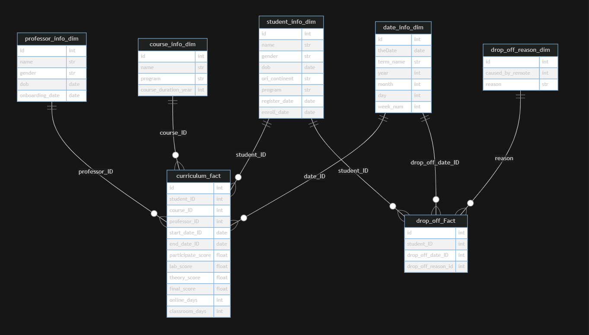
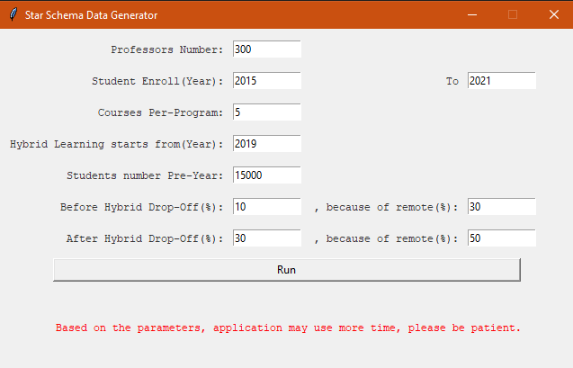

# Start Schema Data Generator

This application can generate excel files that have the relationship of a star schema. The excel files represent the data of the following business cases.

## Business Case - Remote Learning Challenge

The contents of a hybrid course are delivered in a mix of classroom and online. The percentage of online component vs. in-classroom component varies from course to course. For some hybrid courses, the online component and classroom component are 50 – 50, e.g., 1-hour in-classroom lecture and 1-hour online study. Others are 100 – 0 where there is no in-classroom lecture; students only see course instructors during lab sessions.

Algonquin College's enrollment doubled in the past five years, and the trend continues. However, the classroom shortage is now a major hurdle to further increase enrollment. College's management sees that offering hybrid courses is one way to mitigate classroom shortages while maintaining the quality of course contents delivery.

After several years of offering a limited number of hybrid courses as pilot testing, College management decides to hybridize most courses (if not all). However, there are concerns over this decision's impact on the quality of the College's education, mainly:

- The courses' dropoff or failing rate may increase, especially for the first-year students who need more face-to-face instructions while adapting to the new educational environment.
- The enrollment rate may drop. The current students or potential future students may see less value in enrolling in the College. There are numerous cheaper (or accessible) online courses available. The advantage of attending the College diminishes with more courses' contents offered online.
- Although the materials online may have all contents required by the course curriculums. It will lack essential components as instructors' personal experience, thinking processes when making decisions/choices, and industry best practices. That will negatively affect the students' success in the job market.
- The advocates of hybridization insist that with the right combination of online and in-classroom delivery, the hybrid courses will improve the College's quality of education. Through hybrid courses, students acquire or improve self-learning, which is an essential quality sought by today's rapidly changing industry employers.
- After all, going online is where the future sits; the question is not "if" but "how" or "how much."

## Data Understanding

Based on the business case, seven excel files have all the enrollment and dropoff data of recent years. The ER diagram is:

> Refer to the [ER Diagram Source](./docs/ER_Diagram.md) (Generated by Mermaid)

## Application UI

- Professor Numbers: the application will generate n professors with name, DOB, age, etc.
- Student Enroll (Year): the generated students learn in the College from 2015 to 2021.
- Course per program: the application will generate 44 programs(It can define [here](./src/constants_programs.py)), this input is to define how many courses in each program. Ex. Set 5 will define 44*5 courses.
Hybrid learning starts from (Year): the data will have more dropoff rate after the year.
- Students Number pre-year: the students of a year. Ex. If I set student enrolls from 2015 to 2021 and set 15000 pre-year, the application will generate (2021-2015)*15000 students information. Some students will dropoff based on the dropoff rate-setting before/after the "hybrid learning starts year."
- "Before/After Hybrid Drop-off(%)" and "because of remote(%)": set the first one ten and the second one 30 mean 10% of the students will dropoff and 30% of the dropoff students are because of the remote learning.

**Because the application is not async when you click run, the UI will freeze for 1 minute to generate the result. Please wait.**

## Source Files

- [parameters.py](.src/parameters.py): Parameters read from UI. You can define some default variables in the code, such as:
  - Student's DOB
  - Professor's DOB
  - Professor's working year
- [baseclass.py](./src/base class.py): The common functions and base classes
- [constants_continent.py](./src/constants_continent.py): The original places of the students. Change this if you want to analyze the different behaviours of the students
- [constants_dropoffreasons.py](.src/): Drop-off reasons. You can add, remove or modify these reasons.
- [constants_name.py](.src/constants_name.py): Random people names
- [constants_programs.py](.src/constants_programs.py): The: The top n programs in Algonquin College
- [courses.py](.src/courses.py): Course and Curriculum classes
- [dropoff.py](.src/dropoff.py): Drop and reason classes
- [people.py](.src/people.py): Professors and students classes
- [generator.py](.src/generator.py): The main entrance of the application, run this to use the application
- [main.py](.src/main.py): The control class of the application

## Important

1. **Business case description is from an assignment of Algonquin College**
2. **The generated data is based on your setting. They are not the data from Algonquin College**
